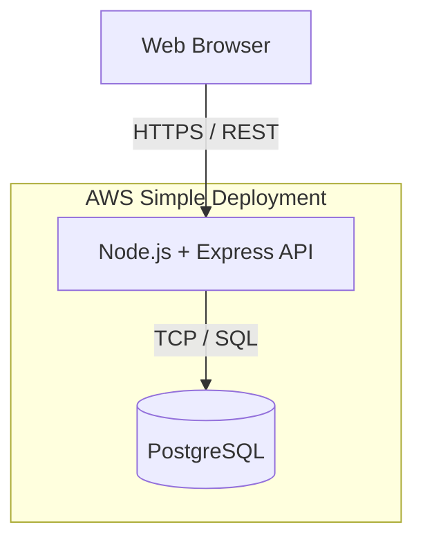
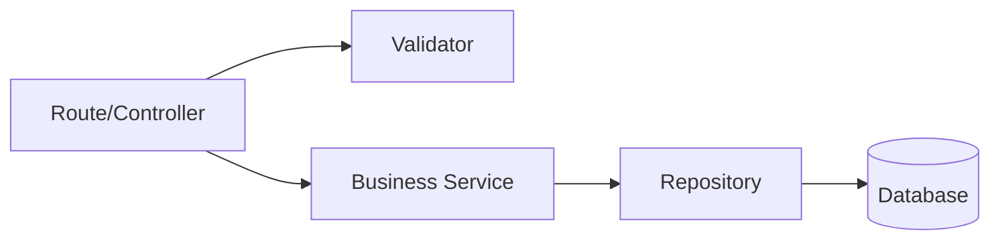
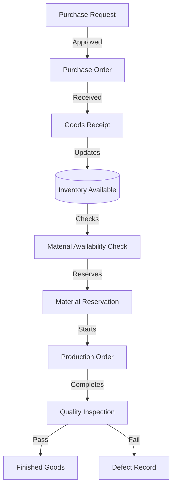

# Technical Architecture

This document defines the technical architecture for the Manufacturing Digital Operations System MVP. It follows a strict "Ponytail" engineering philosophy: the simplest, most direct solution that satisfies the `PRD.md` requirements without premature abstraction or over-engineering.

## 1. System Architecture Overview

The system uses a traditional, synchronous 3-tier architecture.



## 2. Architectural Decisions

| Decision | Choice | Rationale |
|---|---|---|
| **Architecture** | Modular Monolith | The MVP does not have the scale or organizational boundaries to justify microservices. A monolith is easier to deploy, test, and maintain transactional integrity across inventory and production. |
| **API** | REST | Standard, predictable, and fully sufficient for the required UI data access. No need for GraphQL or gRPC overhead. |
| **Database** | PostgreSQL | Relational integrity and ACID transactions are critical for inventory and production data. |
| **Repository** | Monorepo | Keeps frontend, backend, and documentation in sync. Simplifies local development setup. |
| **Deployment** | Simple AWS (EC2/ECS + RDS) | No Kubernetes, no event buses. A standard single-instance or simple container deployment is enough for a portfolio MVP. |

## 3. Monorepo Structure

We use a simple monorepo structure. We avoid unnecessary shared packages unless a strict need arises (e.g., sharing TypeScript interfaces).

```text
manufacturing-digital-operations/
├── apps/
│   ├── frontend/         # React application
│   └── backend/          # Node.js + Express API
├── docs/                 # Documentation (PRD, ERD, Use Cases, Architecture)
├── AGENTS.md
├── DESIGN.md
├── ROADMAP.md
└── package.json          # Root workspace config
```

## 4. Backend Architecture: Modular Monolith

The backend is organized by business domains rather than purely by technical layers, ensuring boundaries remain clear.

### 4.1 Domains
- **Auth:** Login and session management.
- **Users:** User and RBAC management.
- **Master Data:** Materials, Products, Suppliers.
- **Procurement:** Purchase Requests (PR) and Purchase Orders (PO).
- **Inventory:** Goods Receipt, Inventory, Transactions.
- **Production:** Production Orders, Reservations, Output.
- **Quality Control (QC):** Inspections, Defects.
- **Audit:** System-wide traceability.

### 4.2 Layering Pattern
Within each domain, the code is strictly layered:
1. **Routes/Controllers:** Handle HTTP parsing, standard responses, and route-level authorization. Keep business logic out.
2. **Services (Use Cases):** Contain all business rules (e.g., "Cannot reserve more stock than available").
3. **Repositories:** Handle direct PostgreSQL queries (via pg/knex or a lightweight ORM).
4. **Validation:** Input validation (e.g., Zod or Joi) enforced at the API boundary before hitting controllers.



## 5. Frontend Architecture

The frontend is a standard React SPA, focusing on functional density and clear operational flows.

- **Routing:** Standard client-side routing (`react-router`).
- **Structure:** Grouped by feature domain (e.g., `src/features/inventory`).
- **UI Components:** Built on Tailwind CSS + shadcn/ui, heavily customized to match the Industrial Enterprise aesthetic defined in `DESIGN.md`.
- **State Management:** Keep it local to components/pages where possible. Use simple context or lightweight state (Zustand/React Query) only for globally cached data (e.g., user session, reference data).
- **API Client:** Centralized Axios/Fetch wrapper to handle auth headers and global error catching.

## 6. Authentication and Authorization (RBAC)

- **Login:** User authenticates via `/api/auth/login`. Returns a JWT or secure HTTP-only cookie.
- **Authorization:** Standard RBAC. Each route defines allowed roles (e.g., `requireRole(['Manager', 'Purchasing'])`).
- **Frontend Security:** The frontend conditionally renders navigation and actions based on the user's role claim.
- **Backend Security (Source of Truth):** The API independently verifies the role. UI hiding is only for UX; backend validation prevents actual unauthorized access.

## 7. API Boundaries & Error Handling

### 7.1 Example Endpoint Groups
- `GET /api/inventory` (View stock)
- `POST /api/procurement/requests` (Create PR)
- `PATCH /api/procurement/requests/:id/approve` (Approve PR)
- `POST /api/production/orders/:id/reserve` (Reserve materials)

### 7.2 Validation & Errors
- **Frontend:** Provides immediate feedback for obvious errors (empty fields, bad formats) to improve UX.
- **Backend:** The absolute source of truth. Validates all inputs.
- **Error Responses:** Consistent JSON format: `{ error: string, code: string, details?: any }`.
- **Mapping:** 400 (Bad Request / Validation), 401 (Unauthorized), 403 (Forbidden/RBAC), 404 (Not Found), 409 (Conflict/Business Rule), 500 (Internal).

## 8. Business Workflow

The system is designed to support a continuous operational pipeline.



## 9. Transaction Consistency & Auditability

### 9.1 Database Transactions
Operations that modify multiple tables must be wrapped in ACID transactions. Example:
- **Goods Receipt:** Must insert `GOODS_RECEIPT_ITEM`, update `PURCHASE_ORDER` status, and insert `INVENTORY_TRANSACTION` in a single transaction. If one fails, everything rolls back.

### 9.2 Inventory Mutability
Inventory totals are dynamically maintained. `INVENTORY_TRANSACTION` is append-only. Direct updates to inventory totals must align exactly with the inserted transaction log.

### 9.3 Audit Logging
Critical state changes asynchronously (or within the same transaction if critical) write to the `AUDIT_LOG` table.
- **Captured Data:** User ID, Timestamp, Action (e.g., `PO_ISSUED`), Entity, Target ID.

## 10. Testing Strategy

Keep testing pragmatic, focusing on critical paths.
- **Unit Tests:** For complex business logic inside Services (e.g., calculating required BoM quantities, stock availability checks).
- **Integration/API Tests:** Testing the endpoints from Route -> DB to ensure transactions and RBAC constraints work correctly.
- **E2E Tests:** Minimal end-to-end tests for the primary "happy path" workflow (PR -> PO -> Receipt -> Production -> QC).

## 11. Deployment Architecture

Targeting AWS, but intentionally avoiding unnecessary complexity.

- **Frontend:** Static build hosted on AWS S3 + CloudFront (or Vercel/Netlify for MVP simplicity).
- **Backend:** Node.js app running on a single EC2 instance (or ECS Fargate container) behind an Application Load Balancer.
- **Database:** Amazon RDS (PostgreSQL) in a private subnet.

No event-driven architectures, no Redis caches (unless load actually demands it), and no heavy CI/CD pipelines beyond basic GitHub Actions deployment scripts.
