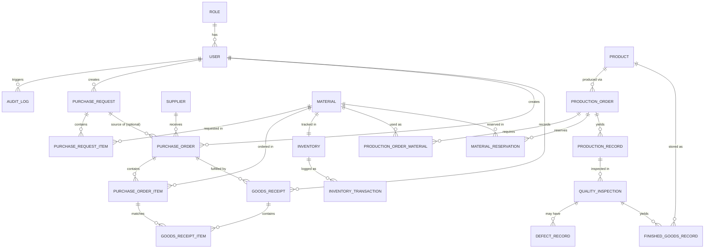

# Entity Relationship Diagram (ERD) & Data Model

This document defines the relational data model for the Manufacturing Digital Operations System MVP. It translates the requirements from the PRD, Business Processes, and Use Cases into a structured database design.

## 1. Mermaid Entity Relationship Diagram

## 2. Entity Definitions

### 2.1 Users & Roles
- **ROLE**
  - **Purpose:** Defines RBAC permissions (Admin, Purchasing, Warehouse, Production, QC, Manager).
  - **Attributes:** `id` (PK, UUID), `name` (String, UK), `description` (String).
- **USER**
  - **Purpose:** System users.
  - **Attributes:** `id` (PK, UUID), `role_id` (FK to Role, Req), `name` (String, Req), `email` (String, UK, Req), `password_hash` (String, Req), `is_active` (Bool, Def: true).
  - **Relationships:** Belongs to 1 Role (1:N).

### 2.2 Master Data
- **MATERIAL** (Raw Materials)
  - **Purpose:** Base items for production.
  - **Attributes:** `id` (PK, UUID), `sku` (String, UK, Req), `name` (String, Req), `unit` (String, Req), `min_stock_threshold` (Decimal, Def: 0).
- **PRODUCT** (Finished Goods)
  - **Purpose:** Manufactured output.
  - **Attributes:** `id` (PK, UUID), `sku` (String, UK, Req), `name` (String, Req), `unit` (String, Req).
- **SUPPLIER**
  - **Purpose:** External vendors.
  - **Attributes:** `id` (PK, UUID), `name` (String, UK, Req), `contact_info` (String).

### 2.3 Procurement
- **PURCHASE_REQUEST (PR)**
  - **Purpose:** Request to buy materials.
  - **Attributes:** `id` (PK, UUID), `user_id` (FK, Req), `request_date` (Date, Req), `status` (Enum: Draft, Pending, Approved, Rejected, Fulfilled; Def: Draft).
- **PURCHASE_REQUEST_ITEM**
  - **Purpose:** Line items in a PR.
  - **Attributes:** `id` (PK, UUID), `pr_id` (FK, Req), `material_id` (FK, Req), `quantity` (Decimal, Req, > 0).
- **PURCHASE_ORDER (PO)**
  - **Purpose:** Formal order to a supplier.
  - **Attributes:** `id` (PK, UUID), `pr_id` (FK, Opt), `supplier_id` (FK, Req), `user_id` (FK, Req), `issue_date` (Date, Req), `status` (Enum: Draft, Issued, Partially_Received, Completed).
- **PURCHASE_ORDER_ITEM**
  - **Purpose:** Line items in a PO.
  - **Attributes:** `id` (PK, UUID), `po_id` (FK, Req), `material_id` (FK, Req), `quantity` (Decimal, Req, > 0), `unit_price` (Decimal, Req).

### 2.4 Inventory & Receiving
- **GOODS_RECEIPT**
  - **Purpose:** Log physical arrival of goods.
  - **Attributes:** `id` (PK, UUID), `po_id` (FK, Req), `user_id` (FK, Req), `receipt_date` (Date, Req).
- **GOODS_RECEIPT_ITEM**
  - **Purpose:** Items actually received.
  - **Attributes:** `id` (PK, UUID), `receipt_id` (FK, Req), `po_item_id` (FK, Req), `received_quantity` (Decimal, Req, > 0).
- **INVENTORY**
  - **Purpose:** Current stock state per material.
  - **Attributes:** `material_id` (PK/FK to Material, UK), `available_stock` (Decimal, Def: 0, >= 0), `reserved_stock` (Decimal, Def: 0, >= 0).
- **INVENTORY_TRANSACTION**
  - **Purpose:** Traceable ledger of stock changes.
  - **Attributes:** `id` (PK, UUID), `material_id` (FK, Req), `transaction_type` (Enum: Receipt, Reservation, Consumption, Adjustment), `quantity_change` (Decimal, Req), `reference_id` (String, Opt - ties to PO, ProdO, etc.), `created_at` (Timestamp, Req).

### 2.5 Production
- **PRODUCTION_ORDER (ProdO)**
  - **Purpose:** Instruction to manufacture.
  - **Attributes:** `id` (PK, UUID), `product_id` (FK, Req), `planned_quantity` (Decimal, Req, > 0), `status` (Enum: Planned, Ready, In_Progress, Completed, Cancelled).
- **PRODUCTION_ORDER_MATERIAL**
  - **Purpose:** The required materials (BoM) for this specific order.
  - **Attributes:** `id` (PK, UUID), `prodo_id` (FK, Req), `material_id` (FK, Req), `required_quantity` (Decimal, Req).
- **MATERIAL_RESERVATION**
  - **Purpose:** Locks materials logically for an order.
  - **Attributes:** `id` (PK, UUID), `prodo_id` (FK, Req), `material_id` (FK, Req), `reserved_quantity` (Decimal, Req).
- **PRODUCTION_RECORD**
  - **Purpose:** Result of manufacturing.
  - **Attributes:** `id` (PK, UUID), `prodo_id` (FK, Req), `actual_quantity_produced` (Decimal, Req), `completion_date` (Date, Req).

### 2.6 Quality Control
- **QUALITY_INSPECTION**
  - **Purpose:** Review of produced goods.
  - **Attributes:** `id` (PK, UUID), `production_record_id` (FK, Req, UK), `inspector_id` (FK to User, Req), `pass_quantity` (Decimal, Req, >= 0), `fail_quantity` (Decimal, Req, >= 0), `inspection_date` (Date, Req).
- **DEFECT_RECORD**
  - **Purpose:** Details for failed items.
  - **Attributes:** `id` (PK, UUID), `inspection_id` (FK, Req), `defect_reason` (String, Req), `quantity` (Decimal, Req, > 0).
- **FINISHED_GOODS_RECORD**
  - **Purpose:** Passed goods ready for final stock.
  - **Attributes:** `id` (PK, UUID), `product_id` (FK, Req), `inspection_id` (FK, Req), `quantity` (Decimal, Req, > 0).

### 2.7 System
- **AUDIT_LOG**
  - **Purpose:** Traceability for critical actions.
  - **Attributes:** `id` (PK, UUID), `user_id` (FK to User, Opt), `action_type` (String, Req), `entity_name` (String, Req), `entity_id` (String, Req), `description` (Text), `created_at` (Timestamp, Req).

## 3. Important Constraints & Business Rules
1. **Stock Non-Negative:** `INVENTORY.available_stock` and `INVENTORY.reserved_stock` must strictly be `>= 0` at the database level.
2. **Quality Validation:** In `QUALITY_INSPECTION`, `pass_quantity` + `fail_quantity` must equal `PRODUCTION_RECORD.actual_quantity_produced`.
3. **Immutability:** `INVENTORY_TRANSACTION`, `AUDIT_LOG`, and `GOODS_RECEIPT_ITEM` rows are strictly append-only (Insert). Updates/Deletes are generally forbidden.
4. **Referential Integrity:** Enforce foreign keys (e.g., deleting a Material is blocked if it is referenced in an active ProdO or Inventory ledger).

## 4. Indexing Considerations
- Create secondary indexes on foreign keys to optimize joins (e.g., `po_id` on `PURCHASE_ORDER_ITEM`).
- Create indexes on frequently filtered status columns (`status` on `PRODUCTION_ORDER`, `PURCHASE_ORDER`).
- Create indexes on chronological fields (`created_at`, `receipt_date`) for fast dashboard aggregation and reporting.
- Unique constraints on `email` (User), `sku` (Material/Product), and `name` (Supplier, Role).
